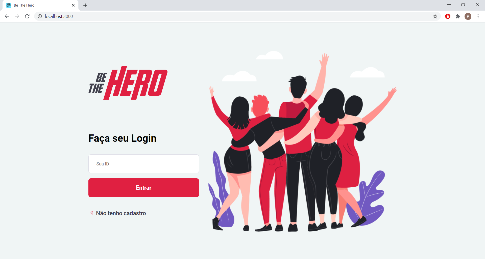
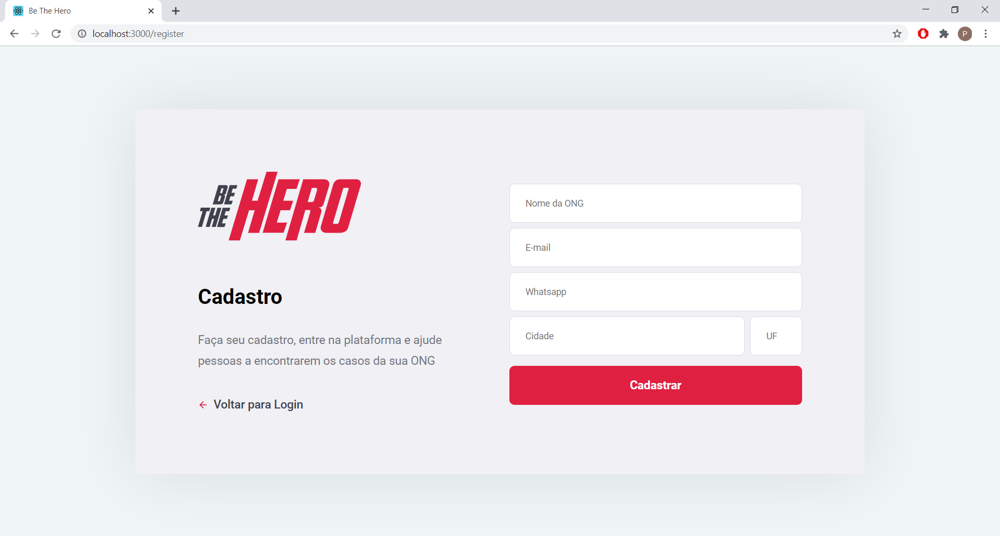
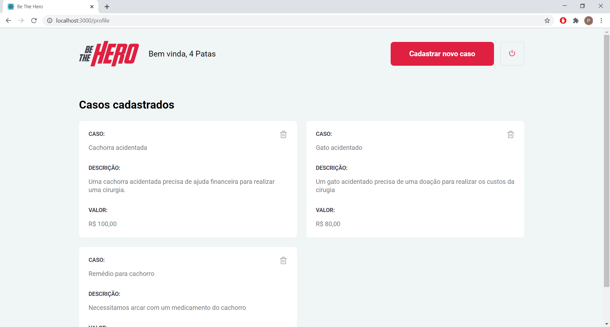
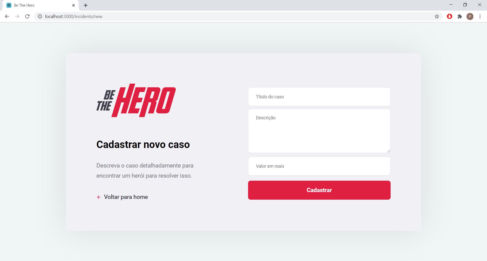

<!--be-the-hero-->

<h1 align="center">  </h1>

<h2 align="center"> Aplicação desenvolvida na semana OmniStack 11.0 da <a href="https://rocketseat.com.br/"> Rocketseat </a></h2>  

 A 11ª edição da Semana OmniStack, ocorrida entre 23/03 e 27/03, 
trouxe como projeto uma aplicação web e mobile inédita. Um sistema para conectar 
pessoas dispostas a ajudar a ONGs que precisam dessa ajuda. Em uma semana foi 
desenvolvida uma aplicação do zero, dominando o backend, frontend e o mobile com 
uma única linguagem e uma única biblioteca de interfaces.

<h2 align="center"> Desenvolvida com as tecnologias  JavaScript, 
 Node,  React, 
 React Native e  SQLite.</h2>

<h3> Outras tecnologias: </h3>
<ul>
  <li> <a href="https://www.npmjs.com/package/nodemon/"> Nodemon </a> </li> 
  <li> <a href="https://expressjs.com/pt-br/"> Express </a> </li>
  <li> <a href="https://www.npmjs.com/package/axios"> Axios </a> </li>
  <li> <a href="https://www.npmjs.com/package/cors"> Cors </a> </li>
  <li> <a href="http://knexjs.org/"> Knex </a> </li>
  <li> <a href="https://expo.io/"> Expo </a> </li>  
</ul>

<h3> Para utilizar: </h3>

 Faça o download do projeto no GitHub  
 Execute <code>npm install</code> nas pastas <b>backend, frontend e mobile</b>, para instalar as dependências. 
 Execute <code>npm start</code> na pasta <b>back-end</b> para rodar o servidor na porta localhost:3333 
 Execute <code>npm start</code> na pasta <b>front-end</b> para rodar a página web na porta localhost:3000 
 Execute <code>npm start</code> na pasta <b>mobile</b>, acesse localhost:19002, leia o QR Code no seu 
celular utilizando o aplicativo Expo <a href="https://play.google.com/store/apps/details?id=host.exp.exponent&hl=pt_BR"> (Download na Playstore) </a> -
<a href="https://apps.apple.com/br/app/expo-client/id982107779"> (Download na App Store) </a>. É possível também usar algum emulador de Android ou iOS. 

<h3> Interface WEB: </h3>

    
Tela de Login:
  
    
    
    
    
    
    
    
    

<h3> Instrutor: </h3> 
<a href="https://github.com/diego3g"> Diego Fernandes </a> - CTO Rocketseat

<h3> Licença </h3>
Este projeto está sobre a licença <a href="https://github.com/PauloHenriqueSousa2020/be-the-hero/blob/master/LICENSE.md"> MIT </a>
